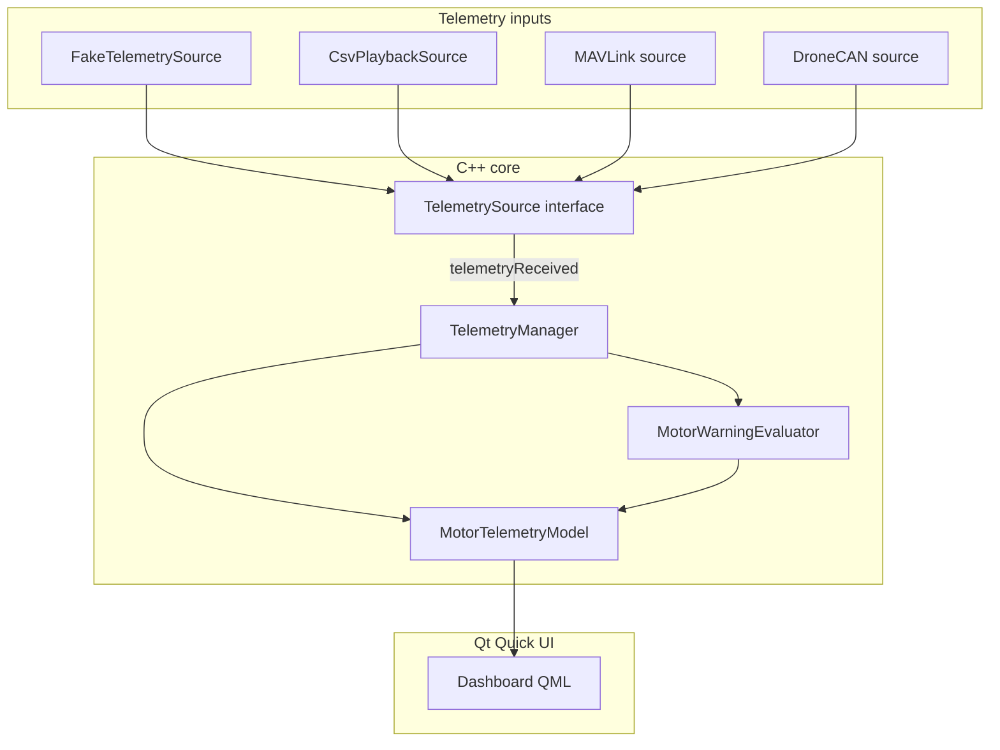

# Rotorboard Architecture

Rotorboard is a **desktop telemetry visualization dashboard** for UAV propulsion systems—initially targeting HOBBYWING XRotor X11 Plus / ESC data. It is inspired by tools like FRC Shuffleboard or SmartDashboard, but scoped to motor/ESC readouts only.

This document describes the **intended architecture**, what is **implemented today**, and how the system will grow over milestones.

---

## Purpose and scope

| In scope | Out of scope |
|----------|--------------|
| Display motor/ESC telemetry (RPM, voltage, current, temperature, status, etc.) | Setting throttle or PWM commands |
| Simulate, log, and replay telemetry | Arming, calibrating, or configuring ESCs |
| Ingest future live sources (MAVLink, DroneCAN, CSV, etc.) | Sending firmware or motor-control commands |
| Stale-data and warning indicators | Any propulsion control surface |

The app **consumes** telemetry. It must never become a motor controller.

---

## Technology stack

| Layer | Choice |
|-------|--------|
| Language | C++17 |
| UI framework | Qt 6 (QML / Qt Quick for the dashboard) |
| Build | CMake 3.21+ |
| Data binding | `QAbstractListModel` exposed to QML |

**Include convention:** CMake adds `src/` to the include path, so headers use paths like `"model/MotorTelemetry.h"` and `"telemetry/TelemetrySource.h"`.

---

## High-level data flow

Telemetry moves in one direction: from input sources into C++ models, then into QML for display. QML never parses protocols or hardware formats.

```text
┌─────────────────────┐
│  TelemetrySource    │  Fake, CSV playback, MAVLink, DroneCAN, …
│  (abstract input)   │
└──────────┬──────────┘
           │ telemetryReceived(MotorTelemetry)
           ▼
┌─────────────────────┐
│  TelemetryManager   │  Owns source lifecycle; routes samples;
│                     │  runs stale sweep timer
└──────────┬──────────┘
           │ updates + evaluates warnings
           ▼
┌─────────────────────┐     ┌──────────────────────────┐
│ MotorTelemetryModel │ ◄── │ MotorWarningEvaluator    │
│ (QAbstractListModel)│     │ (pure rules, no UI)      │
└──────────┬──────────┘     └──────────────────────────┘
           │ roles: motorId, rpm, voltage, isStale, …
           ▼
┌─────────────────────┐
│  QML dashboard      │  Main → DashboardPage → MotorGrid → MotorCard
└─────────────────────┘
```



Optional **logging** sits beside the pipeline (not in the hot path for display):

```text
TelemetryManager ──► CsvTelemetryLogger   (record sessions)
CsvPlaybackSource  ──► TelemetrySource     (replay files)
```

---

## Layer responsibilities

### 1. Domain model (`src/model/`)

**Purpose:** Value types shared across the app. No `QObject`, no signals—plain data.

| File | Role |
|------|------|
| `MotorTelemetry.h` | Single-sample struct: motor ID, RPM, electrical values, PWM, status string, timestamp |
| `MotorTelemetry.cpp` | Ensures the translation unit links; holds `Q_DECLARE_METATYPE` registration site |
| `WarningLevel.h` | `Ok`, `Warning`, `Critical`, `Stale` enum for UI and model roles |

`MotorTelemetry` is registered with Qt’s meta-object system (`Q_DECLARE_METATYPE` + `qRegisterMetaType`) so it can cross signal/slot boundaries.

**Future fields** (not yet added): fault codes, ESC ID, source type, raw status bits, phase/MOS/cap temperatures.

### 2. Telemetry sources (`src/telemetry/`)

**Purpose:** Adapt external or synthetic data into `MotorTelemetry`. Each source implements the same interface so the rest of the app stays unchanged when inputs change.

| Type | Responsibility |
|------|----------------|
| `TelemetrySource` | Abstract `QObject`: `start()` / `stop()`, signal `telemetryReceived(const MotorTelemetry &)` |
| `FakeTelemetrySource` | **Implemented:** 4 motors, ~10 Hz (`QTimer` at 100 ms), randomized realistic ranges |
| `TelemetryManager` | **Implemented:** Owns active source, connects signals to the store, periodic stale check, optional CSV logging |
| `CsvPlaybackSource` | **Implemented:** Reads logged CSV and emits samples on a timeline |
| `MavlinkTelemetrySource` | **Implemented:** UDP listener; parses `ESC_STATUS` (msg 291) into `MotorTelemetry` |
| `MavlinkParser` | **Implemented:** Byte-stream MAVLink v2 parser (`mavlink_parse_char`) |
| `TelemetrySourceFactory` | **Implemented:** Builds fake, playback, or MAVLink source from `SourceConfig` |

Protocol parsing (CAN frames, MAVLink messages, byte layouts) lives **only** inside concrete sources—not in QML or the list model.

### 3. Warning evaluation (`src/warnings/`)

**Purpose:** Centralize threshold logic so QML stays declarative and testable rules live in one place.

| Type | Responsibility |
|------|----------------|
| `MotorWarningEvaluator` | **Implemented:** `(MotorTelemetry, isStale) → WarningLevel` |

**Initial rules:**

| Condition | Level |
|-----------|--------|
| No recent data (stale) | `Stale` |
| Temperature > 80 °C | `Critical` |
| Temperature > 65 °C | `Warning` |
| Current > 120 A | `Critical` |
| Current > 80 A | `Warning` |
| Voltage < 42 V | `Warning` |
| Otherwise | `Ok` |

Stale detection itself is **not** in the evaluator alone: the manager/model marks `isStale` when `now - timestampMillis > 2000 ms`; the evaluator maps that to `WarningLevel::Stale` for display.

### 4. Store / QML bridge (`src/store/`)

**Purpose:** Hold the latest sample per motor and expose a stable API to QML via `QAbstractListModel`.

| Type | Responsibility |
|------|----------------|
| `MotorSampleRingBuffer` | **Implemented:** Fixed-capacity ring buffer (120 samples) for per-motor metric history |
| `MotorTelemetryModel` | **Implemented:** List model with one row per motor; updates on `telemetryReceived`; exposes roles below |

**Suggested model roles:**

| Role | Type (conceptual) | Meaning |
|------|-------------------|---------|
| `motorId` | int | Motor identifier |
| `rpm` | double | Shaft speed |
| `voltage` | double | Input voltage (V) |
| `current` | double | Current (A) |
| `temperatureCelsius` | double | Temperature (°C) |
| `pwm` | double | PWM / throttle feedback (µs) |
| `status` | QString | Human-readable status |
| `timestampMillis` | qint64 | Last sample time (epoch ms) |
| `isStale` | bool | No update within 2 s |
| `warningLevel` | int / enum | From `MotorWarningEvaluator` |
| `rpmHistory` | list of double | Recent RPM samples (oldest→newest, display-only) |
| `currentHistory` | list of double | Recent current samples |
| `temperatureHistory` | list of double | Recent temperature samples |

History buffers are updated in the store layer on each `updateTelemetry()` call—not in telemetry sources. QML binds to roles (e.g. `display: rpm`, `display: warningLevel`). Do not expose raw hardware handles or mutable protocol objects to QML.

### 5. Logging (`src/logging/`)

| Type | Responsibility |
|------|----------------|
| `CsvTelemetryLogger` | **Implemented:** Append samples to CSV during live sessions |
| `CsvPlaybackSource` | **Implemented:** `TelemetrySource` that replays a CSV file (lives in `src/telemetry/`) |

### 6. Application entry (`src/main.cpp`)

**Today:** `QGuiApplication` + `QQmlApplicationEngine`, `AppController` wires `TelemetryManager` + `MotorTelemetryModel`, loads `qml/Main.qml`. CLI flags: `--log [path]` (record session CSV; default `logs/session-YYYYMMDD-HHMMSS.csv`, bare filenames land in `logs/`), `--playback path` (replay CSV instead of fake source), `--mavlink [host:port]` (UDP MAVLink input; default `0.0.0.0:14550`). `--playback` and `--mavlink` are mutually exclusive (MAVLink wins if both are passed). `AppController.sourceLabel` drives the dashboard source badge.

### 7. QML UI (`qml/`)

**Purpose:** Layout and presentation only.

| File | Role |
|------|------|
| `Main.qml` | Window root, loads engine, hosts dashboard |
| `DashboardPage.qml` | Page chrome, title, layout mode toggle, layout container |
| `MotorGrid.qml` | Fixed 4×4 coordinate grid (1-based, top-left is 1,1), drag/snap/swap layout engine |
| `MotorCardSlot.qml` | Draggable grid slot wrapper; snaps to cell coordinates on release |
| `MotorCard.qml` | Per-motor RPM, voltage, current, temperature, status, sparklines |
| `StatusBadge.qml` | Warning/stale visual (color, label) |
| `Sparkline.qml` | Canvas-based mini time-series chart (normalized polyline) |

**Implemented:** Cards react to `warningLevel` and `isStale` (border/background). Inline sparklines for RPM, current, and temperature (milestone 9). **Layout modes:** compact (values only, ~220 px cells) vs detailed (full sparklines, ~310 px cells), toggled in the dashboard header and persisted via QML `Settings`. **Coordinate grid:** each motor card occupies a 1-based cell `(col, row)` on a fixed 4×4 grid; cards drag from the header grip, snap on release, swap when dropped on an occupied cell; per-motor positions persist in QML `Settings` (`MotorGrid/positionsJson`).

---

## Project layout

```text
rotorboard/
├── ARCHITECTURE.md          ← this file
├── CMakeLists.txt           ← build target rotorboard_app
├── README.md
├── .gitignore               ← build/, .DS_Store
│
├── src/
│   ├── main.cpp
│   ├── model/
│   │   ├── MotorTelemetry.h / .cpp
│   │   └── WarningLevel.h
│   ├── telemetry/
│   │   ├── TelemetrySource.h / .cpp
│   │   ├── FakeTelemetrySource.h / .cpp
│   │   ├── CsvPlaybackSource.h / .cpp
│   │   ├── MavlinkParser.h / .cpp
│   │   ├── MavlinkTelemetrySource.h / .cpp
│   │   ├── TelemetrySourceConfig.h
│   │   ├── TelemetrySourceFactory.h / .cpp
│   │   └── TelemetryManager.h / .cpp
│   ├── store/
│   │   ├── MotorSampleRingBuffer.h / .cpp
│   │   └── MotorTelemetryModel.h / .cpp
│   ├── warnings/
│   │   └── MotorWarningEvaluator.h / .cpp
│   └── logging/
│       └── CsvTelemetryLogger.h / .cpp
│
├── logs/
│   └── .gitkeep                           (session CSVs written here; `logs/*.csv` gitignored)
│
├── samples/
│   └── session.csv                        (example playback file)
│
├── third_party/
│   ├── README.md                          (MAVLink header setup)
│   └── mavlink_c/                         (clone from mavlink/c_library_v2)
│
└── qml/
    ├── Main.qml
    ├── DashboardPage.qml
    ├── MotorGrid.qml
    ├── MotorCardSlot.qml
    ├── MotorCard.qml
    ├── StatusBadge.qml
    └── Sparkline.qml
```

---

## Implementation status

| Component | Status |
|-----------|--------|
| `MotorTelemetry`, `WarningLevel` | Done |
| `TelemetrySource`, `FakeTelemetrySource` | Done |
| `TelemetryManager` (stale sweep, source lifecycle) | Done |
| `MotorTelemetryModel` | Done |
| `MotorWarningEvaluator` | Done |
| QML dashboard (`Qt6::Quick`, `qt_add_qml_module`) | Done |
| `CsvTelemetryLogger` | Done |
| `CsvPlaybackSource` (timer, CLI `--playback`) | Done |
| `MavlinkTelemetrySource` (UDP, `ESC_STATUS`, CLI `--mavlink`) | Done |
| `DroneCanTelemetrySource` (HOBBYWING StatusMsg1/2/3, SLCAN, CLI `--dronecan`) | Done |
| `MotorSampleRingBuffer` + history model roles | Done |
| `Sparkline.qml` sparklines on motor cards | Done |

---

## Development roadmap

Build order keeps protocol complexity out of the UI until the pipeline is solid:

1. **Fake telemetry source** — done
2. **Live dashboard** — done (model + manager + QML cards)
3. **Stale-data detection** — done (2 s threshold, `isStale` role)
4. **Warning evaluation** — done (`MotorWarningEvaluator`, `warningLevel` role)
5. **CSV logging** — done (`CsvTelemetryLogger`, `--log` / `startLogging`)
6. **CSV playback** — done (`CsvPlaybackSource`, `--playback`, `samples/session.csv`)
7. **MAVLink input** — done (`MavlinkTelemetrySource`, UDP + `ESC_STATUS`, `--mavlink`)
8. **DroneCAN / HOBBYWING input** — done (`DroneCanTelemetrySource`, `SlcanTransport`, HOBBYWING StatusMsg1/2/3 merge cache, `--dronecan`)
9. **Advanced widgets** (charts, layouts) — sparklines, layout modes, and draggable 4×4 coordinate grid done; full-page charts remain

---

## Design principles

1. **Separation of concerns** — Parsing and transport stay in `TelemetrySource` implementations; UI only sees `MotorTelemetry` and model roles.
2. **QML is declarative** — No business rules in bindings; use C++ models and evaluators.
3. **One-way data flow** — Sources emit samples; manager/model aggregate; QML reads.
4. **No global mutable state** — Prefer Qt parent ownership and explicit manager wiring.
5. **RAII / smart ownership** — Avoid raw owning pointers; `std::unique_ptr` or Qt parent-child where appropriate.
6. **Safety boundary** — No APIs for throttle, arm, calibrate, or firmware commands.
7. **Incremental CMake** — Add sources and Qt modules as layers land (Core → Quick + `qt_add_qml_module`).

---

## Build and run (current milestone)

```bash
cmake -S . -B build
cmake --build build
./build/rotorboard_app
./build/rotorboard_app --log
./build/rotorboard_app --log custom.csv
./build/rotorboard_app --log /tmp/session.csv
./build/rotorboard_app --playback samples/session.csv
./build/rotorboard_app --mavlink
./build/rotorboard_app --mavlink 127.0.0.1:14550
./build/rotorboard_app --dronecan COM3
./build/rotorboard_app --dronecan COM3 --log
ctest --test-dir build
```

The dashboard opens a Qt Quick window. Use `--log` to record telemetry to CSV during a session (defaults to timestamped files under repo `logs/`), `--playback` to replay a logged file, `--mavlink` to listen for MAVLink `ESC_STATUS` over UDP (default port 14550), or `--dronecan` to read HOBBYWING DroneCAN telemetry over SLCAN serial.

**MAVLink setup:** Clone headers once: `git clone --depth 1 https://github.com/mavlink/c_library_v2.git third_party/mavlink_c` (see `third_party/README.md`).

**DroneCAN setup:** Clone libcanard once: `git clone --depth 1 https://github.com/UAVCAN/libcanard.git third_party/libcanard`. HOBBYWING DSDL definitions are vendored under `third_party/hobbywing_dsdl/`; decoding is in `src/telemetry/dronecan/HobbywingMessages.cpp`.

**Manual MAVLink test:** Run the app with `--mavlink`, then forward `ESC_STATUS` packets to UDP port 14550 (e.g. via pymavlink, mavlink-router, or a flight controller telemetry output).

**Manual DroneCAN test:** Connect a USB-CAN dongle running SLCAN firmware to the HOBBYWING CAN bus, then run `rotorboard --dronecan COMx` (replace `COMx` with the serial port). Unit tests use canned HOBBYWING frames via `rotorboard_dronecan_tests`.

**HOBBYWING field mapping (v1):** `StatusMsg1` → RPM, PWM, fault status; `StatusMsg2` → bus voltage, current, temperature; `StatusMsg3` → MOS/cap/motor temperatures (used when Msg2 temp is absent). ESC node ID maps to `motorId`. MAVLink `ESC_STATUS` has no temperature field; DroneCAN provides MOS/cap temps.

---

## References

- **Target hardware context:** HOBBYWING XRotor X11 Plus ESC telemetry (visualization only).
- **Analogous tools:** FRC Shuffleboard / SmartDashboard (live tables, not motor control).

For hands-on milestones and assignments, use this document as the map; implement one layer at a time and keep QML free of protocol details.
