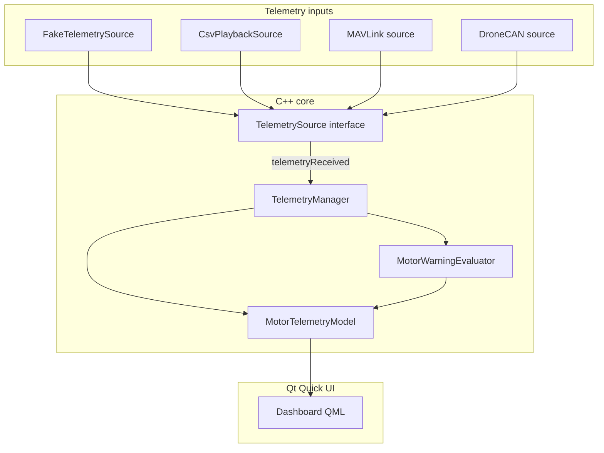

# Rotorboard Architecture

Rotorboard is a **desktop telemetry visualization dashboard** for UAV propulsion systems—initially targeting HOBBYWING XRotor X11 Plus / ESC data. It is inspired by tools like FRC Shuffleboard or SmartDashboard, but scoped to motor/ESC readouts only.

This document describes the **intended architecture**, what is **implemented today**, and how the system will grow over milestones.

---

## Purpose and scope

| In scope | Out of scope |
|----------|--------------|
| Display motor/ESC telemetry (RPM, voltage, current, temperature, status, etc.) | Setting throttle or PWM commands |
| Simulate, log, and replay telemetry | Arming, calibrating, or configuring ESCs |
| Ingest future live sources (MAVLink, DroneCAN, CSV, etc.) | Sending firmware or motor-control commands |
| Stale-data and warning indicators | Any propulsion control surface |

The app **consumes** telemetry. It must never become a motor controller.

---

## Technology stack

| Layer | Choice |
|-------|--------|
| Language | C++17 |
| UI framework | Qt 6 (QML / Qt Quick for the dashboard) |
| Build | CMake 3.21+ |
| Data binding | `QAbstractListModel` exposed to QML |

**Include convention:** CMake adds `src/` to the include path, so headers use paths like `"model/MotorTelemetry.h"` and `"telemetry/TelemetrySource.h"`.

---

## High-level data flow

Telemetry moves in one direction: from input sources into C++ models, then into QML for display. QML never parses protocols or hardware formats.

```text
┌─────────────────────┐
│  TelemetrySource    │  Fake, CSV playback, MAVLink, DroneCAN, …
│  (abstract input)   │
└──────────┬──────────┘
           │ telemetryReceived(MotorTelemetry)
           ▼
┌─────────────────────┐
│  TelemetryManager   │  Owns source lifecycle; routes samples;
│                     │  runs stale sweep timer
└──────────┬──────────┘
           │ updates + evaluates warnings
           ▼
┌─────────────────────┐     ┌──────────────────────────┐
│ MotorTelemetryModel │ ◄── │ MotorWarningEvaluator    │
│ (QAbstractListModel)│     │ (pure rules, no UI)      │
└──────────┬──────────┘     └──────────────────────────┘
           │ roles: motorId, rpm, voltage, isStale, …
           ▼
┌─────────────────────┐
│  QML dashboard      │  Main → DashboardPage → MotorGrid → MotorCard
└─────────────────────┘
```



Optional **logging** sits beside the pipeline (not in the hot path for display):

```text
TelemetryManager ──► CsvTelemetryLogger   (record sessions)
CsvPlaybackSource  ──► TelemetrySource     (replay files)
```

---

## Layer responsibilities

### 1. Domain model (`src/model/`)

**Purpose:** Value types shared across the app. No `QObject`, no signals—plain data.

| File | Role |
|------|------|
| `MotorTelemetry.h` | Single-sample struct: motor ID, RPM, electrical values, PWM, status string, timestamp |
| `MotorTelemetry.cpp` | Ensures the translation unit links; holds `Q_DECLARE_METATYPE` registration site |
| `WarningLevel.h` | `Ok`, `Warning`, `Critical`, `Stale` enum for UI and model roles |

`MotorTelemetry` is registered with Qt’s meta-object system (`Q_DECLARE_METATYPE` + `qRegisterMetaType`) so it can cross signal/slot boundaries.

**Future fields** (not yet added): fault codes, ESC ID, source type, raw status bits, phase/MOS/cap temperatures.

### 2. Telemetry sources (`src/telemetry/`)

**Purpose:** Adapt external or synthetic data into `MotorTelemetry`. Each source implements the same interface so the rest of the app stays unchanged when inputs change.

| Type | Responsibility |
|------|----------------|
| `TelemetrySource` | Abstract `QObject`: `start()` / `stop()`, signal `telemetryReceived(const MotorTelemetry &)` |
| `FakeTelemetrySource` | **Implemented:** 4 motors, ~10 Hz (`QTimer` at 100 ms), randomized realistic ranges |
| `TelemetryManager` | **Planned:** Owns active source, connects signals to the store, periodic stale check |
| `CsvPlaybackSource` | **Planned:** Reads logged CSV and emits samples on a timeline |

Protocol parsing (CAN frames, MAVLink messages, byte layouts) lives **only** inside concrete sources—not in QML or the list model.

### 3. Warning evaluation (`src/warnings/`)

**Purpose:** Centralize threshold logic so QML stays declarative and testable rules live in one place.

| Type | Responsibility |
|------|----------------|
| `MotorWarningEvaluator` | **Planned:** `(MotorTelemetry, isStale) → WarningLevel` |

**Initial rules:**

| Condition | Level |
|-----------|--------|
| No recent data (stale) | `Stale` |
| Temperature > 80 °C | `Critical` |
| Temperature > 65 °C | `Warning` |
| Current > 120 A | `Critical` |
| Current > 80 A | `Warning` |
| Voltage < 42 V | `Warning` |
| Otherwise | `Ok` |

Stale detection itself is **not** in the evaluator alone: the manager/model marks `isStale` when `now - timestampMillis > 2000 ms`; the evaluator maps that to `WarningLevel::Stale` for display.

### 4. Store / QML bridge (`src/store/`)

**Purpose:** Hold the latest sample per motor and expose a stable API to QML via `QAbstractListModel`.

| Type | Responsibility |
|------|----------------|
| `MotorTelemetryModel` | **Planned:** List model with one row per motor; updates on `telemetryReceived`; exposes roles below |

**Suggested model roles:**

| Role | Type (conceptual) | Meaning |
|------|-------------------|---------|
| `motorId` | int | Motor identifier |
| `rpm` | double | Shaft speed |
| `voltage` | double | Input voltage (V) |
| `current` | double | Current (A) |
| `temperatureCelsius` | double | Temperature (°C) |
| `pwm` | double | PWM / throttle feedback (µs) |
| `status` | QString | Human-readable status |
| `timestampMillis` | qint64 | Last sample time (epoch ms) |
| `isStale` | bool | No update within 2 s |
| `warningLevel` | int / enum | From `MotorWarningEvaluator` |

QML binds to roles (e.g. `display: rpm`, `display: warningLevel`). Do not expose raw hardware handles or mutable protocol objects to QML.

### 5. Logging (`src/logging/` — planned)

| Type | Responsibility |
|------|----------------|
| `CsvTelemetryLogger` | Append samples to CSV during live sessions |
| `CsvPlaybackSource` | `TelemetrySource` that replays a CSV file |

### 6. Application entry (`src/main.cpp`)

**Today:** `QCoreApplication` + `FakeTelemetrySource` + debug lambda (console smoke test).

**Target:** `QGuiApplication` + `QQmlApplicationEngine`, construct `TelemetryManager` + `MotorTelemetryModel`, register context property or set model on root object, load `qml/Main.qml`.

### 7. QML UI (`qml/`)

**Purpose:** Layout and presentation only.

| File | Role |
|------|------|
| `Main.qml` | Window root, loads engine, hosts dashboard |
| `DashboardPage.qml` | Page chrome, title, layout container |
| `MotorGrid.qml` | Grid of motor cards bound to the list model |
| `MotorCard.qml` | Per-motor RPM, voltage, current, temperature, status |
| `StatusBadge.qml` | Warning/stale visual (color, label) |

**Planned:** Cards react to `warningLevel` and `isStale` (border/background). No charts in milestone 1.

---

## Project layout

```text
rotorboard/
├── ARCHITECTURE.md          ← this file
├── CMakeLists.txt           ← build target rotorboard_app
├── README.md
├── .gitignore               ← build/, .DS_Store
│
├── src/
│   ├── main.cpp
│   ├── model/
│   │   ├── MotorTelemetry.h / .cpp
│   │   └── WarningLevel.h
│   ├── telemetry/
│   │   ├── TelemetrySource.h / .cpp
│   │   ├── FakeTelemetrySource.h / .cpp
│   │   └── TelemetryManager.h / .cpp    (planned)
│   ├── store/
│   │   └── MotorTelemetryModel.h / .cpp   (planned)
│   ├── warnings/
│   │   └── MotorWarningEvaluator.h / .cpp (planned)
│   └── logging/                           (planned)
│       ├── CsvTelemetryLogger.h / .cpp
│       └── CsvPlaybackSource.h / .cpp
│
└── qml/                                   (planned UI)
    ├── Main.qml
    ├── DashboardPage.qml
    ├── MotorGrid.qml
    ├── MotorCard.qml
    └── StatusBadge.qml
```

---

## Implementation status

| Component | Status |
|-----------|--------|
| `MotorTelemetry`, `WarningLevel` | Done |
| `TelemetrySource`, `FakeTelemetrySource` | Done |
| Console `main` smoke test | Done |
| `TelemetryManager` | Scaffold only (empty files) |
| `MotorTelemetryModel` | Scaffold only |
| `MotorWarningEvaluator` | Scaffold only |
| QML dashboard | Empty placeholders |
| CMake QML module (`Qt6::Quick`) | Not wired yet (Core-only build) |
| CSV logger / playback | Not started |
| MAVLink / DroneCAN | Not started |

---

## Development roadmap

Build order keeps protocol complexity out of the UI until the pipeline is solid:

1. **Fake telemetry source** — done (console)
2. **Live dashboard** — model + manager + QML cards
3. **Stale-data detection** — 2 s threshold in C++, `isStale` role
4. **Warning evaluation** — `MotorWarningEvaluator` + `warningLevel` role
5. **CSV logging**
6. **CSV playback**
7. **MAVLink input**
8. **DroneCAN / HOBBYWING input**
9. **Advanced widgets** (charts, layouts)

---

## Design principles

1. **Separation of concerns** — Parsing and transport stay in `TelemetrySource` implementations; UI only sees `MotorTelemetry` and model roles.
2. **QML is declarative** — No business rules in bindings; use C++ models and evaluators.
3. **One-way data flow** — Sources emit samples; manager/model aggregate; QML reads.
4. **No global mutable state** — Prefer Qt parent ownership and explicit manager wiring.
5. **RAII / smart ownership** — Avoid raw owning pointers; `std::unique_ptr` or Qt parent-child where appropriate.
6. **Safety boundary** — No APIs for throttle, arm, calibrate, or firmware commands.
7. **Incremental CMake** — Add sources and Qt modules as layers land (Core → Quick + `qt_add_qml_module`).

---

## Build and run (current milestone)

```bash
cmake -S . -B build
cmake --build build
./build/rotorboard_app
```

Expect log lines for simulated motors at ~10 Hz. Once QML is integrated, the same binary will open a window instead of (or in addition to) console output.

---

## References

- **Target hardware context:** HOBBYWING XRotor X11 Plus ESC telemetry (visualization only).
- **Analogous tools:** FRC Shuffleboard / SmartDashboard (live tables, not motor control).

For hands-on milestones and assignments, use this document as the map; implement one layer at a time and keep QML free of protocol details.
